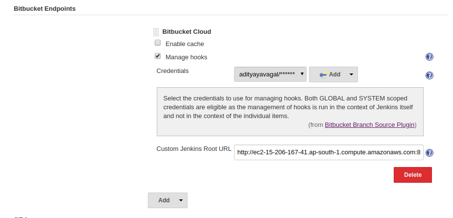

# Jenkins MultiBranch Project Setup with Bitubucket Repository

**Prerequisites:** Install BlueOcean Plugin from Jenkins Plugin Store(this installs the plugins needed).

- Installing the BlueOcean Plugin installs a plugin called **BitBucket source Plugin**.
- To configure BitBucket EndPoint(To enable Job triggering on push to repository).
  - Go to **Manage Jenkins** and Click on **Configure System**
  - Search for **Bitbucket Endpoint** and Click on **Add** and select **Bitbucket Cloud**
  - Now check **Manage Hooks** and that opens a small form with **Credentials and Custom Jenkins URL**,
    - For **Credentials**, Click on Add Credentials and Enter username and password for jenkins to access the Repository and now choose the same credential in the dropdown.
    - For **Custom Jenkins Root URL**, Enter the URL and save the settings.

- Creating a Multi Branch Pipeline Project
  - Click on **New Item** and select **Multibranch Pipeline** while creating the Project.
    
  